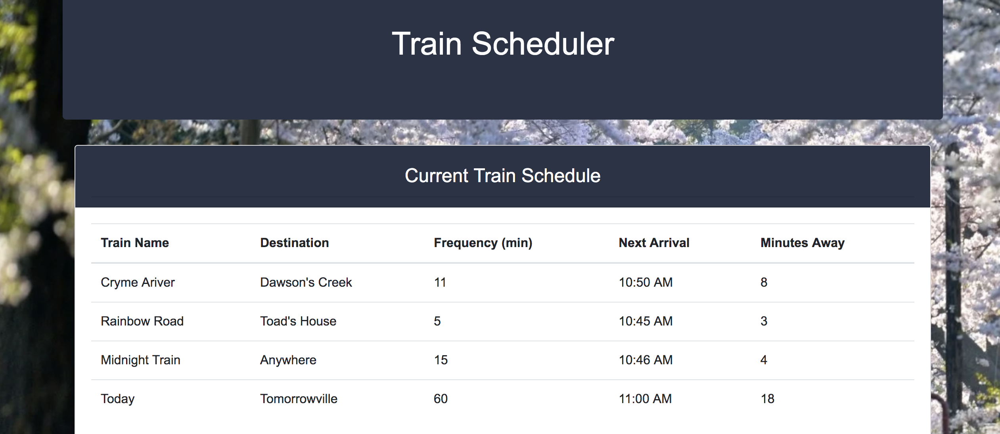
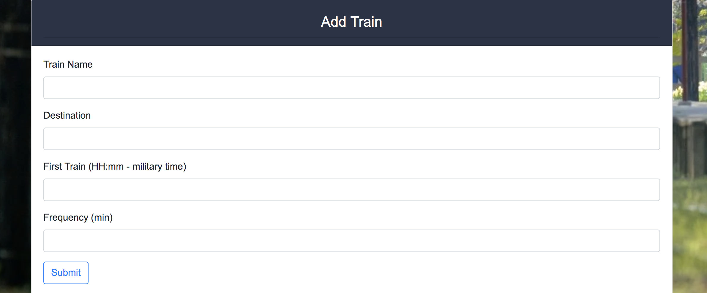

# Train Scheduler 

Created during Week 7 of KU Coding Bootcamp. This is a Firebase Application to accept input from user to create a fictional train list and calculate the next train and minutes away.

## Screen Shots

List of trains saved to the Firebase Database.

Form to create new trains to add to the database.

## Technologies used
- Google Fonts
- Bootstrap
- jQuery
- Firebase

